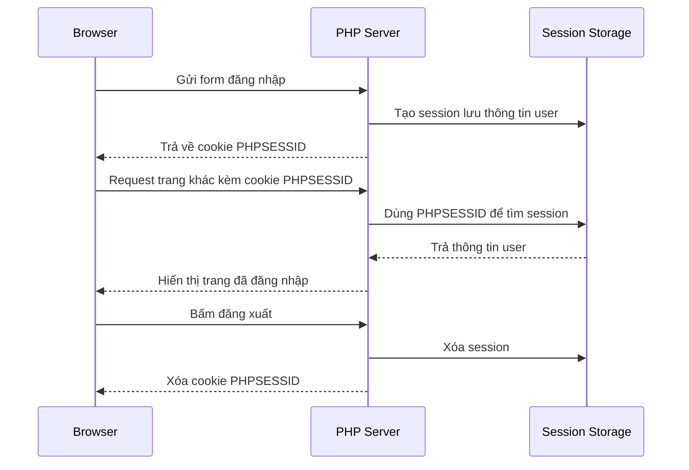

# Demo Cookie & Session

## Yêu cầu

- PHP 8.x
- `make`

## Cách chạy

Chạy lệnh sau tại thư mục gốc của dự án:

```bash
make run
```

Sau đó mở trình duyệt tại:

```text
http://localhost:8002
```

## Xem cookie ở đâu, session ở đâu.
- Cookie nằm trên browser, em có thể mở DevTools để xem trực tiếp ở Application vào mục Cookie.
- Session nằm trên server, browser chỉ giữ session id.
- Session có thể lưu ở 3 chỗ: file (/var/lib/php/sessions), database và redis

## Sơ đồ hoạt động của cookie/session


